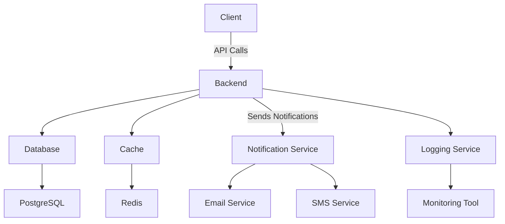

```mermaid
    graph TD;
        A[Client] -->|API Calls| B[Backend];
        B --> C[Database];
        B --> D[Cache];
        B -->|Sends Notifications| E[Notification Service];
        E --> F[Email Service];
        E --> G[SMS Service];
        D --> H[Redis];
        C --> I[PostgreSQL];
        B --> J[Logging Service];
        J --> K[Monitoring Tool];
```