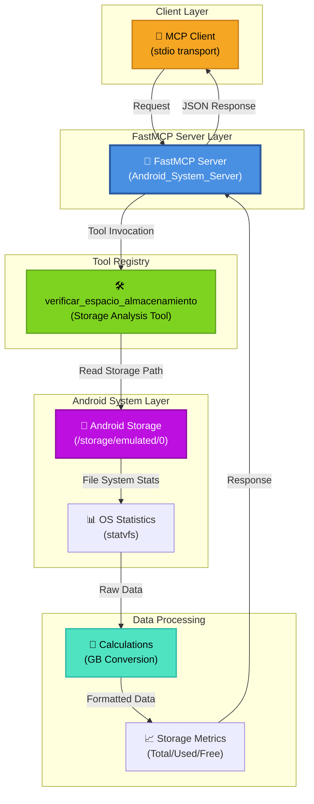

# Android System Server MCP - Architecture Overview

## System Architecture



## Component Description

### 1. **Client Layer** 🔌
- **MCP Client**: Communicates with the FastMCP server via stdio transport
- Sends tool invocation requests and receives JSON responses

### 2. **FastMCP Server Layer** 📡
- **Android_System_Server**: The main MCP server instance
- Handles incoming requests and routes them to appropriate tools
- Uses stdio for local IPC (Inter-Process Communication)

### 3. **Tool Registry** 🛠️
- **verificar_espacio_almacenamiento()**: Storage verification tool
  - Analyzes Android device storage
  - Returns formatted storage metrics

### 4. **Android System Layer** 💾
- **Storage Path**: `/storage/emulated/0` (Android shared storage)
- **OS Statistics**: Uses `os.statvfs()` to read file system information
  - `f_bavail`: Free blocks available
  - `f_blocks`: Total blocks
  - `f_frsize`: Fragment size

### 5. **Data Processing** 🔢
- **Calculations**: Converts bytes to Gigabytes (GB)
  - Formula: `(blocks × frsize) / (1024³)`
- **Results**: Returns structured storage metrics
  - Total storage capacity
  - Occupied storage
  - Free storage

## Data Flow

```
1. Client sends tool request to MCP Server
2. Server routes request to verificar_espacio_almacenamiento()
3. Tool accesses Android storage filesystem
4. statvfs() returns raw block statistics
5. Tool converts to GB and calculates metrics
6. Tool returns formatted string response
7. Server sends JSON-encoded response to client
```

## Key Technologies

| Component | Technology |
|-----------|-----------|
| **Framework** | FastMCP (Model Context Protocol) |
| **Language** | Python 3.x |
| **OS Interface** | `os.statvfs()` |
| **Transport** | stdio (Standard Input/Output) |
| **Platform** | Android (via Termux or similar) |

## Error Handling

The tool includes exception handling that:
- Catches file system access errors
- Returns user-friendly error messages
- Prevents server crashes

## Future Extensions

Possible enhancements:
- 📱 Additional device information tools
- 🔋 Battery status monitoring
- 📡 Network connectivity checks
- 📹 Camera/multimedia access
- 🔐 Permission management tools
